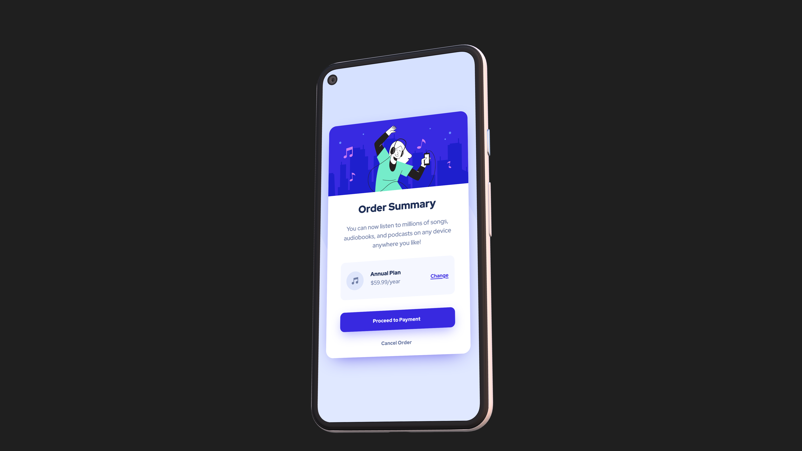
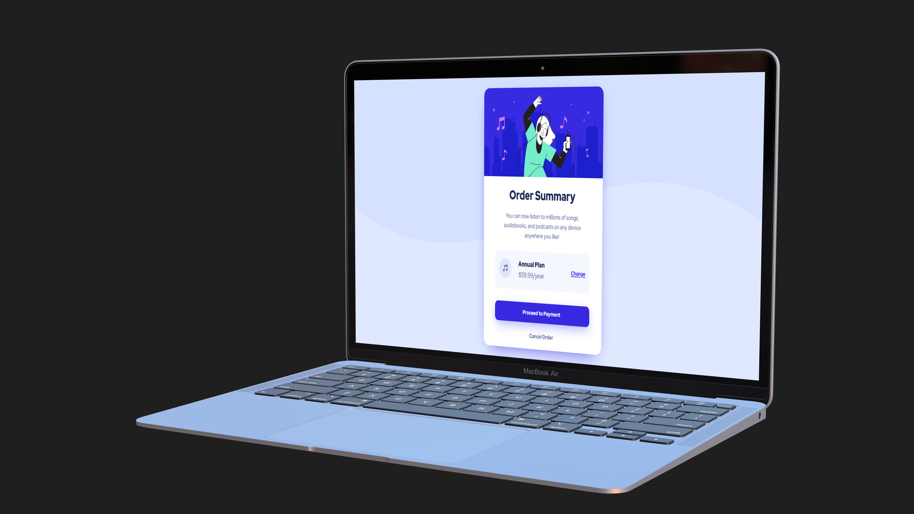

# Frontend Mentor - Order summary card solution

This is a solution to the [Order summary card challenge on Frontend Mentor](https://www.frontendmentor.io/challenges/order-summary-component-QlPmajDUj). Frontend Mentor challenges help me improve my coding skills by building realistic projects.

## Table of contents

- [Frontend Mentor - Order summary card solution](#frontend-mentor---order-summary-card-solution)
  - [Table of contents](#table-of-contents)
  - [Overview](#overview)
    - [The challenge](#the-challenge)
    - [Screenshot](#screenshot)
    - [Links](#links)
    - [Built with](#built-with)
    - [What I learned](#what-i-learned)
    - [Continued development](#continued-development)
    - [Useful resources](#useful-resources)
  - [Author](#author)

## Overview

This mini project is my first experience of creating a real project as a front-end developer! I'm so excited to share it with you.

### The challenge

The challenge is to build out this order summary card component and get it looking as close to the design as possible, and even make it better!

As well as making it responsive for small phones, I tried to make it good looking for large screens as well. Another challenge was keeping the HTML semantic, and the CSS clean. Due to my limited experience, I did not apply a mobile-first workflow, but for future projects I will take it into consideration!

### Screenshot




### Links

- Live Site URL: [Add live site URL here](https://your-live-site-url.com)

### Built with

- Semantic HTML5 markup
- CSS custom properties
- Flexbox

### What I learned

Using CSS custom properties to create custom colors:

```css
:root {
  --pale-blue: hsl(225, 100%, 94%);
  --bright-blue: hsl(245, 75%, 52%);
  --very-pale-blue: hsl(225, 100%, 98%);
  --desaturated-blue: hsl(224, 23%, 55%);
  --dark-blue: hsl(223, 47%, 23%);
}
```

CSS basic rest:

```css
* {
  padding: 0;
  margin: 0;
  box-sizing: border-box;
}

img {
  display: block;
}
```

### Continued development

Since I learned a lot on this project, I'm looking forward to trying more challenges from Frontend Mentor.

### Useful resources

- [Get Waves](https://getwaves.io) - With this tool, you can create beautiful waves!
- [Google Fonts](https://fonts.google.com) - Google Fonts is a library of more than 1,400 open source font families and APIs for convenient use via CSS and Android.
- [Device Frame](https://deviceframes.com/) - Generate beautiful 3D device scenes to showcase your app UI.

## Author

- Telegram - [Aram Moradian](https://t.me/OhSorrow)
- Frontend Mentor - [@OhSorrow](https://www.frontendmentor.io/profile/OhSorrow)
- GitHub - [OhSorrow](https://github.com/OhSorrow)
